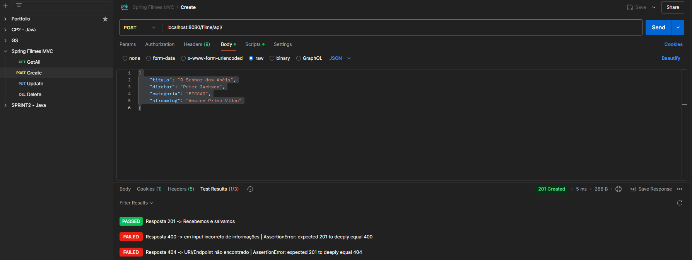

# **🎬 Spring MVC - Gerenciador de Filmes**

<details>
  <summary>CP 2 - Trabalho de QA</summary>

- Olá, professor. Segue os integrantes do grupo:
  - Diego Costa Silva - RM 552648
  - Mauricio Vieira Pereira - RM 553748
  - Lucas Minozzo Bronzeri - RM 553745

</details>

## **📖 Descrição do Projeto**

Este projeto é um exemplo de aplicação **Spring MVC**, desenvolvido durante as aulas de Java. Ele utiliza o padrão **MVC (Model-View-Controller)** para separar a lógica de negócios da apresentação, garantindo flexibilidade e facilidade de manutenção.

Além disso, o projeto disponibiliza **endpoints RESTful** para manipulação de dados de filmes, permitindo realizar operações como:

- ✏️ **Cadastro**
- ✂️ **Edição**
- 🗑️ **Exclusão**
- 📜 **Listagem de filmes**

O sistema também permite a criação de categorias de filmes.

---

## 🏗️ **Estrutura do Projeto**

### **Classes e Atributos**

####  **Filme**

A classe principal, que representa um filme no sistema.

```java
@Getter
@Setter
@NoArgsConstructor
@AllArgsConstructor
@Entity
@Table(name = "filmes")
public class Filme {
    @Id
    @GeneratedValue(strategy = GenerationType.IDENTITY)
    private Long id;
    @Column(name = "titulo")
    private String titulo;
    @Column(name = "diretor")
    private String diretor;
    @Column(name = "categoria")
    @Enumerated(EnumType.STRING)
    private Categoria categoria;
    @Column(name = "streaming")
    private String streaming;
}
```

📂 **Arquitetura:**
- 📁 `/controller/FilmeController.java`
- 📁 `/service/FilmeService.java`
- 📁 `/repository/FilmeRepository.java`
- 📁 `/dto/FilmeRequest.java`
- 📁 `/dto/FilmeResponse.java`

---

**Categoria**

Colocamos os atributos de categoria como `ENUM` para garantir que os valores sejam fixos e conhecidos em tempo de compilação. Isso ajuda a evitar erros de digitação e garante a integridade dos dados.

```java
@Getter
@NoArgsConstructor
@AllArgsConstructor
public enum Categoria {
    ROMANCE("Romance"),
    FICCAO("Ficção"),
    TERROR("Terror"),
    DRAMA("Drama"),
    ACAO("Ação");

    private String descricao;
}
```
---

## 🎮 **Controller**

### 📸 Endpoints da Web (Model and View)

- 🔍**GET** `/filme`
    - Descrição: Exibe o formulário para criar um novo filme.

- 🔍**GET** `/filme/list`
    - Descrição: Exibe a lista de todos os filmes.

- 🔍**GET** `/filme/edit/{id}`
    - Descrição: Exibe o formulário para editar um filme existente.

- 🔍**GET** `/filme/delete/{id}`
    - Descrição: Deleta um filme pelo ID e redireciona para a lista de filmes.
---
### 🧾 Endpoints da API (JSON)

- 🔍**GET** `/filme/api/`
    - Descrição: Retorna a lista de todos os filmes em formato JSON.

    - ✉️**POST** `/filme/api/`
      - Descrição: Cria um novo filme a partir dos dados fornecidos em JSON.
      - Ex.:
       ```json
      {
        "titulo": "O Senhor dos Anéis",
        "diretor": "Peter Jackson",
        "categoria": "FICCAO",
        "streaming": "Amazon Prime"
      }
      ```

- 🛠️**PUT** `/filme/api/{id}`
  - Descrição: Atualiza os dados de um filme específico pelo ID a partir dos dados fornecidos em JSON.
  - Ex.:
    ```json
    {
        "titulo": "O Senhor dos Anéis - Edição Estendida",
        "diretor": "Peter Jackson",
        "categoria": "FICCAO",
        "streaming": "Amazon Prime"
    }
    ```
  
- 🔍🆔 **GET** `/filme/api/{id}`
    - Descrição: Retorna os detalhes de um filme específico pelo ID em formato JSON.

- 🗑️**DELETE** `/filme/api/{id}`
    - Descrição: Deleta um filme específico pelo ID.


---

## 🧩 **Dependências**

Essa aplicação foi criada em **Java 21**.
```java
    java {
        toolchain {
            languageVersion = JavaLanguageVersion.of(21)
        }
    }
```

E utilizamos as seguintes dependências:


**Lombok** (para geração automática de código), **Spring Boot** (configuração simplificada), **Spring Data JPA** (acesso a dados), **H2 Database** (banco em memória), **Thymeleaf** (renderização de views) e **Webjars** (gerenciamento de dependências front-end como Bootstrap).

```java
dependencies {
	implementation 'org.springframework.boot:spring-boot-starter-data-jpa'
	implementation 'org.springframework.boot:spring-boot-starter-thymeleaf'
	implementation 'org.springframework.boot:spring-boot-starter-web'
	implementation 'org.springframework.boot:spring-boot-starter-validation'
	implementation 'org.webjars:bootstrap:5.3.3'
	compileOnly 'org.projectlombok:lombok:1.18.36'
	annotationProcessor 'org.projectlombok:lombok:1.18.36'
	runtimeOnly 'com.h2database:h2'
	testImplementation 'org.springframework.boot:spring-boot-starter-test'
	testRuntimeOnly 'org.junit.platform:junit-platform-launcher'
}
```

---
## 🧪 Testes

### 👨‍🚀 **Testes de API - Postman**

Utilizamos a sessão de scripts do Postman para testar as respostas da API. Contém testes positivos e negativos de todos endpoints API da aplicação (GET, POST, PUT, DELETE).

**Exporte o arquivo `doc/SpringMVC.postman_collection.json` para o Postman e execute os testes.**

